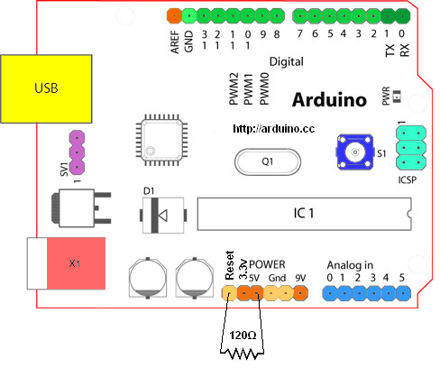

# Jig-IO-Controller-Arduino
產線治具上使用的 IO 控制器

用法:

鮑率 115200

1. IO 控制(可控 IO 為 D2~D13)

   shell>d2 on -> d2 腳位輸出高電位

   shell>d13 off -> d13 腳位輸出低電位

2. 取得分位版號

   shell>ver

3. 取得溫度

   shell>temp

4. 取得濕度

   shell>hum

*注意*

由於 Arduino UNO Auto Reset 的特性可能會影響我們的操作，因此必須先將此功能關掉，詳情可參考 https://playground.arduino.cc/Main/DisablingAutoResetOnSerialConnection/

我們採取的方式是在 Reset 與 5V 間加裝電阻(上傳前需取下)，做法如下圖:

